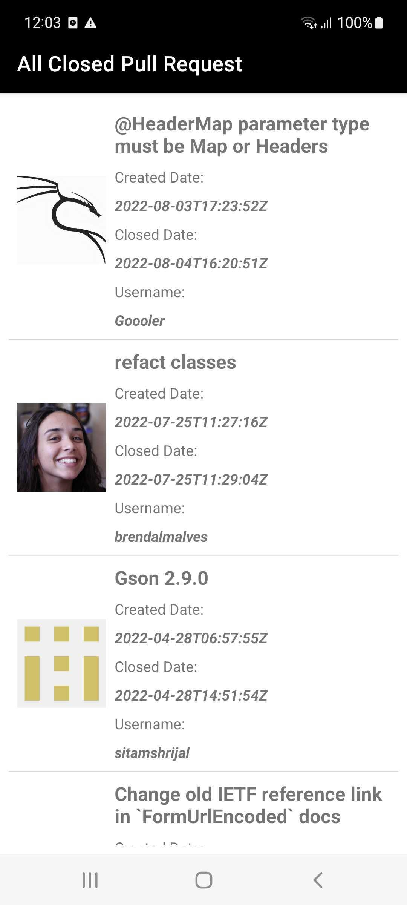

# Introduction

<h4>Features</h4>
<ul>
  <li>Get list of all closed pull request</li>
   <li>Pull To Refresh </li>
   <li>Error Case Handling</li>
  </ul>

<h4>Screenshots</h4>
<table>
<thead>
<tr>
<th align="center">List of all closed pull request</th>

</tr>
</thead>
<tbody>
<tr>
<td> </td>

</tr>
</tbody>
</table>

<h4>Library used</h4>
<ul>
<li>Viewmodel</li>
<li>Flow</li>
<li>Hilt</li>
<li>Coroutine</li>
<li>Pagination</li>
<li>Retrofit</li>
<li>Glide</li>
<li>Swiperefreshlayout</li>
</ul>

<h4><a href="https://github.com/gauravaggarwal93/github-api/blob/master/github-app.apk" target="_blank">APK</a></h4>

